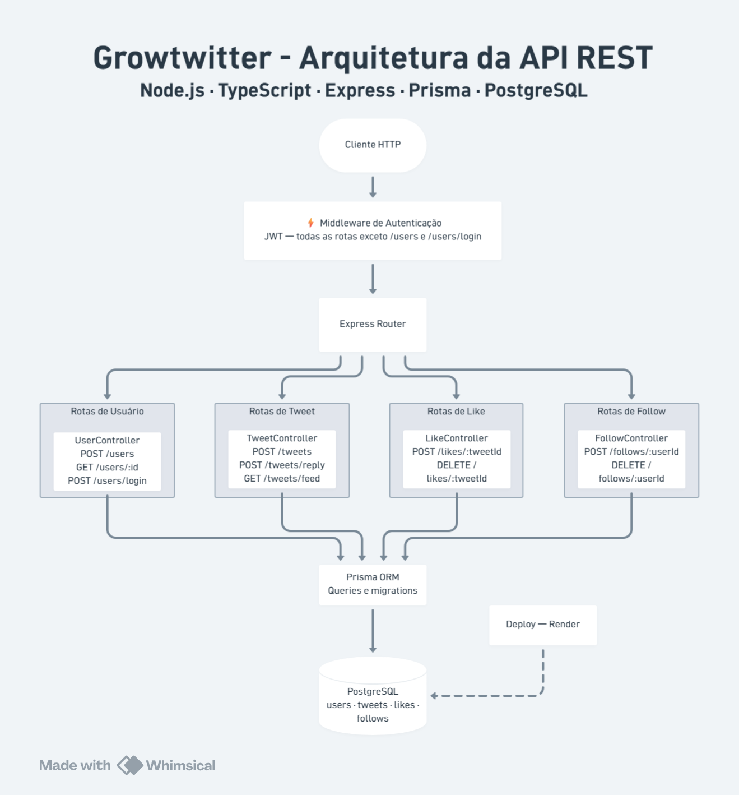
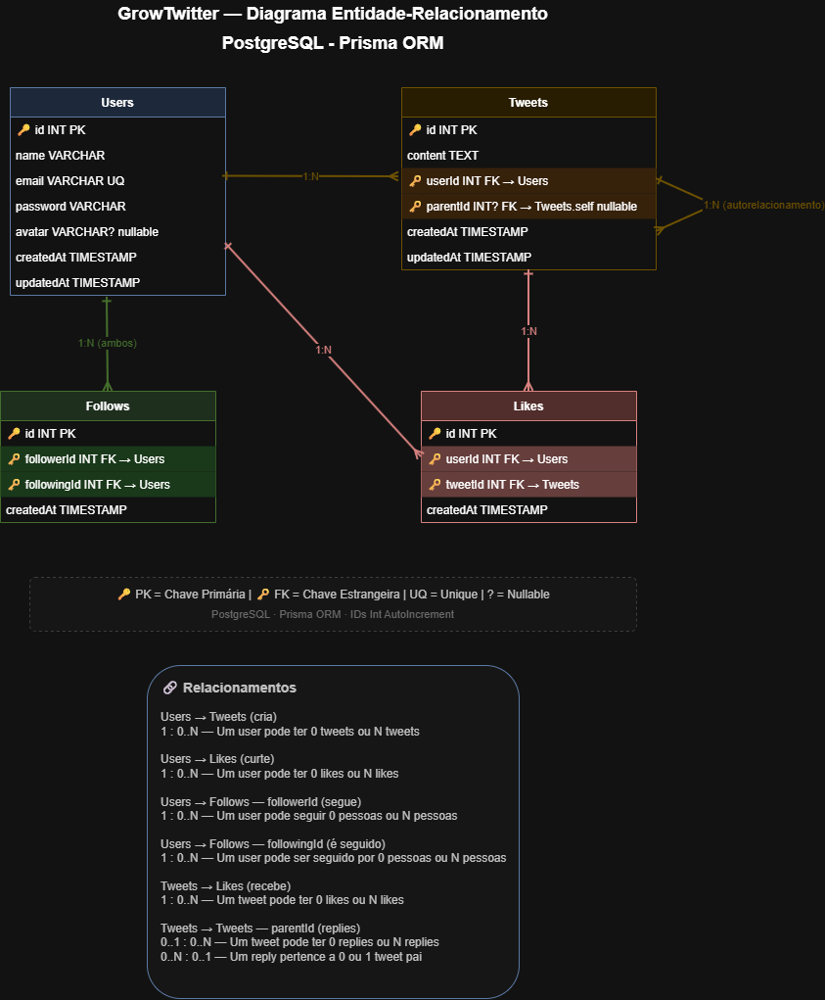

# 🐦 Growtwitter API

API REST desenvolvida como projeto final do curso **Web Full Stack II (Growdev)**.

Simula uma rede social estilo Twitter (X), permitindo que usuários interajam através de tweets, replies, curtidas e seguidores.

🚀 **API em produção:** [https://growtwitter-api-zg6s.onrender.com](https://growtwitter-api-zg6s.onrender.com)

---

## 📌 Índice
 
- [Sobre o Projeto](#-sobre-o-projeto)
- [Tecnologias](#-tecnologias)
- [Arquitetura e Design Patterns](#%EF%B8%8F-arquitetura-e-design-patterns)
- [Modelos de Dados](#%EF%B8%8F-modelos-de-dados)
- [Regras de Negócio](#-regras-de-negócio)
- [Variáveis de Ambiente](#%EF%B8%8F-vari%C3%A1veis-de-ambiente)
- [Instalação e Execução](#-instalação-e-execução)
- [Autenticação](#-autenticação)
- [Rotas da API](#-rotas-da-api)
- [Padrão de Resposta da API](#-padrão-de-resposta-da-api)
- [Documentação Swagger](#-documentação-swagger)
- [Melhorias Futuras](#-melhorias-futuras)

---

## 📖 Sobre o Projeto

O **Growtwitter** é uma API REST que simula as principais funcionalidades de uma rede social. Os usuários podem se cadastrar, publicar tweets, responder tweets de outros usuários, curtir publicações e seguir outros perfis. O feed exibe os tweets do próprio usuário somados aos tweets de quem ele segue.

---

## 🚀 Tecnologias

| Tecnologia | Descrição |
|---|---|
| Node.js + TypeScript | Runtime e linguagem |
| Express | Framework HTTP |
| Prisma ORM | Acesso ao banco de dados |
| PostgreSQL | Banco de dados relacional |
| JWT (jsonwebtoken) | Autenticação e autorização |
| bcrypt | Hash de senhas |
| zod | Validação de dados |
| zod-to-openapi | Integração validação + Swagger |
| Swagger (swagger-ui-express) | Documentação da API |
| Docker + Docker Compose | Containerização |

---

## 🏗️ Arquitetura e Design Patterns

```bash
src/
 ┣ assets/        # Imagens do projeto
 ┣ controllers/   # Recebe requisições HTTP e chama os services
 ┣ database/      # Acesso ao banco (Repository Pattern / Prisma)
 ┣ dtos/          # Contratos de entrada e saída de dados
 ┣ envs/          # Configuração de variáveis de ambiente
 ┣ middlewares/   # Interceptadores (auth JWT, validação)
 ┣ models/        # Entidades de domínio
 ┣ routes/        # Definição das rotas da API
 ┣ services/      # Regras de negócio da aplicação
 ┣ utils/         # Funções utilitárias (JWT, bcrypt, errors)
 ┣ validators/    # Validação de dados com Zod
 ┣ app.ts         # Configuração do Express
 ┣ express.d.ts   # Extensões de tipos do Express
 ┣ server.ts      # Inicialização do servidor
 ┗ swagger.ts     # Configuração da documentação Swagger
```

**Patterns utilizados:**

- **Layered Architecture** — Separação clara entre controllers, services e database.
- **Repository Pattern** — Implementado em `database/`, abstraindo o acesso ao banco com Prisma.
- **Service Layer** — Lógica de negócio centralizada nos services, sem regras nos controllers.
- **Middleware Pattern** — Autenticação JWT e validação de dados de forma reutilizável.



---

## 🗂️ Modelos de Dados

O banco de dados é composto por 4 entidades principais. O diagrama abaixo ilustra os relacionamentos entre elas:



### User

Representa um usuário cadastrado na plataforma.

| Campo | Tipo | Descrição |
|---|---|---|
| id | INT | Identificador único (autoincrement) |
| name | STRING | Nome do usuário |
| email | STRING | E-mail (único) |
| password | STRING | Senha (hash bcrypt) |
| avatar | STRING? | URL da imagem de perfil (nullable) |
| createdAt | DATETIME | Data de criação |
| updatedAt | DATETIME | Data de atualização |

### Tweet

Representa um tweet ou reply. Quando `parentId` está preenchido, o tweet é uma resposta a outro tweet.

| Campo | Tipo | Descrição |
|---|---|---|
| id | INT | Identificador único (autoincrement) |
| content | STRING | Conteúdo do tweet |
| userId | INT FK | Referência ao usuário autor |
| parentId | INT? FK | Referência ao tweet pai (nullable) |
| createdAt | DATETIME | Data de criação |
| updatedAt | DATETIME | Data de atualização |

### Like

Representa a curtida de um usuário em um tweet.

| Campo | Tipo | Descrição |
|---|---|---|
| id | INT | Identificador único (autoincrement) |
| userId | INT FK | Referência ao usuário |
| tweetId | INT FK | Referência ao tweet curtido |
| createdAt | DATETIME | Data de criação |

### Follow

Representa o relacionamento de seguir entre dois usuários.

| Campo | Tipo | Descrição |
|---|---|---|
| id | INT | Identificador único (autoincrement) |
| followerId | INT FK | Usuário que segue |
| followingId | INT FK | Usuário que é seguido |
| createdAt | DATETIME | Data de criação |

---

## ⚙️ Variáveis de Ambiente

Crie um arquivo `.env` na raiz do projeto com base no `.env.example`:

```env
# Porta da aplicação
PORT=3030

# Banco de dados (Docker)
DATABASE_URL="postgresql://admin:senha123@db:5432/meu_banco?schema=public"
POSTGRES_USER=admin
POSTGRES_PASSWORD=senha123
POSTGRES_DB=meu_banco

# JWT
JWT_SECRET=sua_chave_secreta_aqui
JWT_EXPIRES_IN=24h
```

---

## 🐳 Instalação e Execução

### Com Docker (recomendado)

Pré-requisitos: [Docker](https://www.docker.com/) e [Docker Compose](https://docs.docker.com/compose/)

```bash
# 1. Clone o repositório
git clone https://github.com/Viniciusm15/growtwitter-api.git
cd growtwitter-api

# 2. Copie o arquivo de variáveis de ambiente
cp .env.example .env

# 3. Suba os containers (API + banco de dados)
docker compose up --build

# 4. Em outro terminal, execute as migrations
docker compose exec app npx prisma migrate dev

# 5. (Opcional) Abra o Prisma Studio para visualizar o banco
docker compose exec app npx prisma studio
```

A API estará disponível em `http://localhost:3030`.
O Prisma Studio estará disponível em `http://localhost:5555`.

---

### Sem Docker (local)

Pré-requisitos: Node.js 18+ e PostgreSQL rodando localmente.

```bash
# 1. Clone o repositório
git clone https://github.com/Viniciusm15/growtwitter-api.git
cd growtwitter-api

# 2. Copie e ajuste o arquivo de variáveis de ambiente
# Edite DATABASE_URL para apontar para seu PostgreSQL local
cp .env.example .env

# 3. Instale as dependências
npm install

# 4. Execute as migrations
npx prisma migrate dev

# 5. Inicie o servidor
npm run dev
```

---

## 🔐 Autenticação

A API utiliza **JWT (JSON Web Token)**:

1. Cadastre-se: `POST /users`
2. Faça login: `POST /users/login` — retorna um token
3. Envie o token no header de todas as rotas protegidas:

```
Authorization: Bearer <token>
```

---

## 📋 Rotas da API
 
> ✅ Requer autenticação &nbsp;&nbsp; ❌ Pública
 
### Usuários
 
| Método | Rota | Descrição | Auth | Status |
|---|---|---|---|---|
| POST | `/users` | Cadastrar novo usuário | ❌ | 201, 400, 409 |
| GET | `/users/:id` | Buscar usuário com tweets e seguidores | ✅ | 200, 401, 404 |
| POST | `/users/login` | Login com email e senha | ❌ | 200, 401 |
 
### Tweets
 
| Método | Rota | Descrição | Auth | Status |
|---|---|---|---|---|
| POST | `/tweets` | Criar tweet | ✅ | 201, 400, 401, 404 |
| POST | `/tweets/reply` | Responder a um tweet | ✅ | 201, 400, 401, 404 |
| GET | `/tweets/feed` | Tweets próprios + tweets de quem segue | ✅ | 200, 401 |
 
### Likes
 
| Método | Rota | Descrição | Auth | Status |
|---|---|---|---|---|
| POST | `/likes/:tweetId` | Curtir um tweet | ✅ | 201, 401, 404, 409 |
| DELETE | `/likes/:tweetId` | Descurtir um tweet | ✅ | 200, 401, 404 |
 
### Seguidores
 
| Método | Rota | Descrição | Auth | Status |
|---|---|---|---|---|
| POST | `/follow/:userId` | Seguir um usuário | ✅ | 201, 400, 401, 404, 409 |
| DELETE | `/follow/:userId` | Deixar de seguir um usuário | ✅ | 200, 400, 401, 404 |
 
---

## 📦 Padrão de Resposta da API

✅ Sucesso
```json
{
  "success": true,
  "message": "Operação realizada com sucesso",
  "data": { }
}
```

❌ Erro
```json
{
  "success": false,
  "message": "Descrição do erro"
}
```

> ℹ️ O campo `data` representa os dados retornados pela API.

---

## 🧪 Documentação Swagger

Com a API rodando, acesse a documentação interativa em:

```
http://localhost:3030
```

---

## 🔮 Melhorias Futuras

- [ ] Paginação no feed
- [ ] Upload de imagem de perfil
- [ ] Testes automatizados
